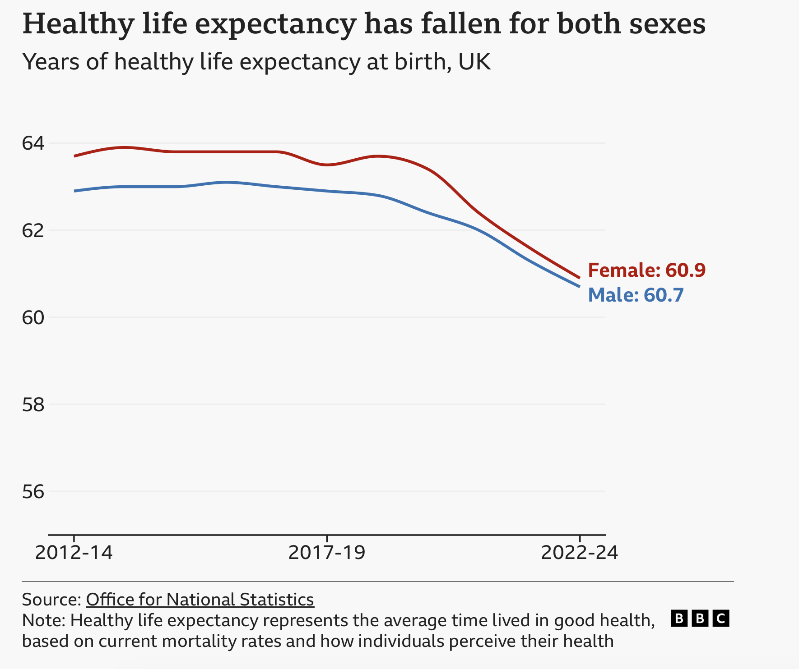

# On healthy-life expectancy

Following on from  the BBC page [UK healthy life expectancy falls by two years
in past decade](https://www.bbc.co.uk/news/articles/c20q07w3gl9o).

Superficially, the graph in that page suggest that, contrary to the title,
healthy life expectancy was in steady-state until around the year 2020, then
dropped rapidly.

So, superficially, the better headline would be "UK healthy
life expectancy falls by two years since 2020" — raising some interesting
questions.

But — where do those data come from?  Is the graph a good representation?

It looks like they come from [the Office of National Statistics](https://www.ons.gov.uk/peoplepopulationandcommunity/healthandsocialcare/healthandlifeexpectancies/datasets/healthstatelifeexpectancyallagesuk).

This repository is a re-analysis to check the graph and conclusions.
